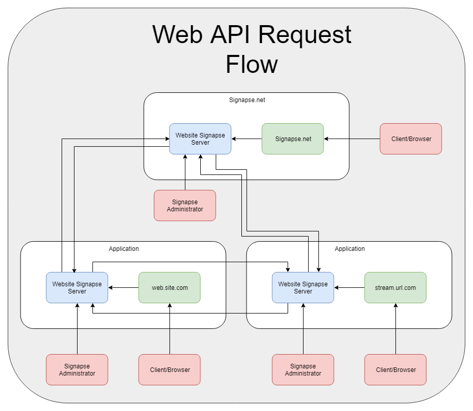

# Signapse.net

***`WARNING: This project is still a proof-of-concept. You should not under any circumstances attempt to use this in a production environment in its current state`***

Signapse is a protocol for a collection of like-minded sites to share content and revenue.  The goals of this project are as follows:

* Allow members a way to support and enjoy multiple content creators instead of needing to select the one or two that they can afford.
* Provide content creators a way to share their content to a wider audience that is more likely to appreciate it.
* Provide a risk-free framework for building trust and community
* Maximize privacy by limiting the data that is shared between each node.

## Project Structure

The *Signapse.Web* project is the code base used by **Signapse.net**. It is provided primarily for transparency, but you are encouraged to use whatever site design and functionality you prefer. This is where all of your member data will be located. Essential pieces of data, such as fee account info and user name, will need to be pushed to YOUR affiliate server and no one else.

The *Signapse.Affiliate* project is the primary service for the network.  These nodes process transactions and synchronize data with each of the other affiliates.

The *Signapse.BlockChain* project is a library for managing a transactional blockchain.  In Signapse the currency is time, and the time spent from your members and affiliates' members watching your shared content is considered when collecting and distributing a member's fee.

The *Signapse.Server.Common* and *Signapse.Common* libraries contain the bulk of the functionality that would be required by anyone wishing to implement their own version of the protocol.

## How it works

The underlying principle is pretty straight-forward.  Each site has their main site source code, and an additional signapse server for managing transactions and synchronizing the network.

### Use Cases:

#### 1. Alice's user watches Alice's content from her site

Alice receives 100% of the fee

#### 2. Alice's user watches Joe's content from her site

Alice keeps the advertiser fee and the rest goes to Joe.

#### 3. Alice's user watches Alice's content from Joe's site (using authentication)

Not considered for fee distribution.

#### 4. Alice's user watches Joe's content from Joe's site (using authentication)

Not considered for fee distribution.

#### 5. Alice's user watches Jordan's content from Joe's site (using authentication)

Alice keeps the advertiser fee and the rest goes to Jordan.

## Do we really need another block chain?

Signapse's block chain exists as a shared immutable ledger. It has no real value outside of that.

When members view/stream content, their time is logged into the ledger. When it comes time for a site to process the user's fee, the site must also reference the ledger to compute how much of the fee goes to each of the affiliates. These transactions are then also added to the ledger.

Transactions are confirmed using consensus. If there are 3 or fewer affiliates, consensus is 100%.  If there are over 3 affiliates, consensus is over 50% of affiliates.

Each transaction in the ledger is signed by the originating server of the transaction and the target server of the transaction, if any.

## What about nefarious users?

There is a certain level of trust involved with affiliation. Ultimately, it comes down to doing your due diligence when deciding who to accept into your network. To understand the risks with affiliation, it might be helpful to go through some scenarios of how someone might try to abuse the system.

### 1. Joe fabricates 1000 members

Joe could create 100,000 members and the result would be the same - he would be expected to pay Alice for any of her content that those members consumed. The instant Alice sees that Joe didn't pay, she can choose to drop him from her network.

### 2. Joe shares his content with Alice, but does not present her content on his site.

This will result in a one-directional system where Alice keeps the "advertisement" portion of her member's fees for each of Joe's videos her users watch. If Alice does not think this is a fair trade, she can either create more compelling content, or she can remove her affiliation with Joe.

### 3. Joe doesn't create any content and is only using his affiliation with Alice for "passive income"

Similar to the prior scenario, this will create a unidirectional system where Joe's members consume Alice's content. In this case, Joe would keep the "advertisement" portion of each member's time and pay the rest to Alice. And like the prior scenario, Alice can choose whether to remain affiliated with Joe. (*NOTE*: this is how affiliation with signapse.net works)

### 4. Joe simulates requests from one of Alice's members.

Members are able to login to affiliate sites using OpenAuth Identities to access to their original membership site. To mitigate abuse, Joe will not receive any fee payments from Alice's user while they are on his site.
 
### 5. Joe simulates requests from his own users to dilute their minutes

Because Joe's members will be seen as spending most of their time viewing Joe's content, the percentage of
time given to Alice will be smaller.

This results in a situation similar to #2, but is more difficult to detect. Mitigating this falls back to being more
careful about the affiliates you endorse.

### 6. Joe serves his members private content from his server, in addition to the shared content from Alice's server

This is only detrimental to Joe. Because he isn't able to log time that is being spent on private content, Alice will
recieve a larger portion of Joe's users' revenue.
